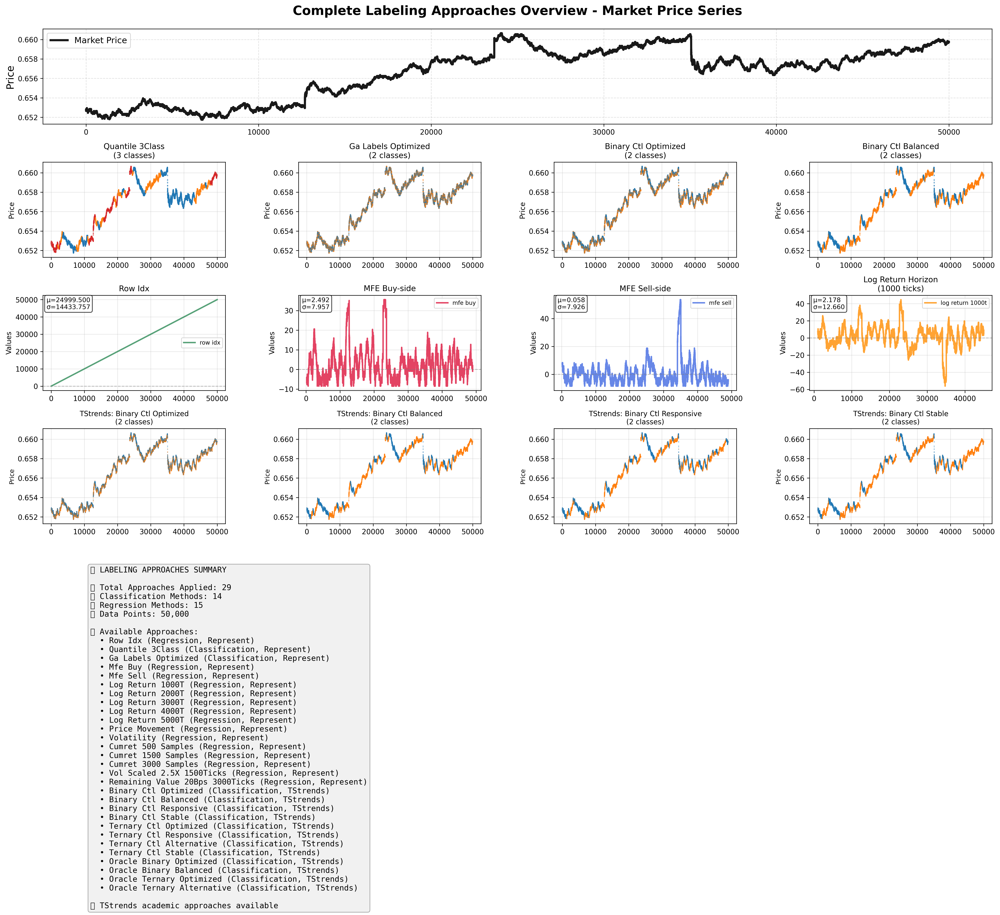
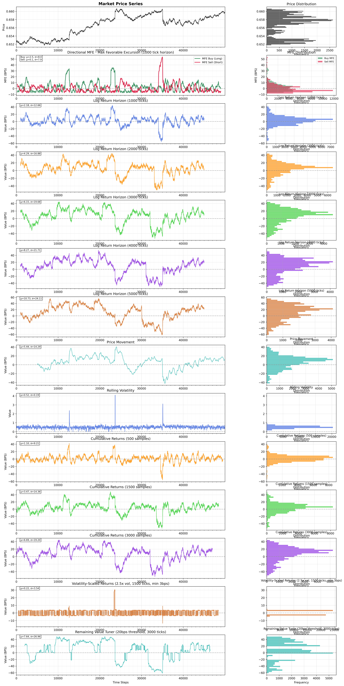
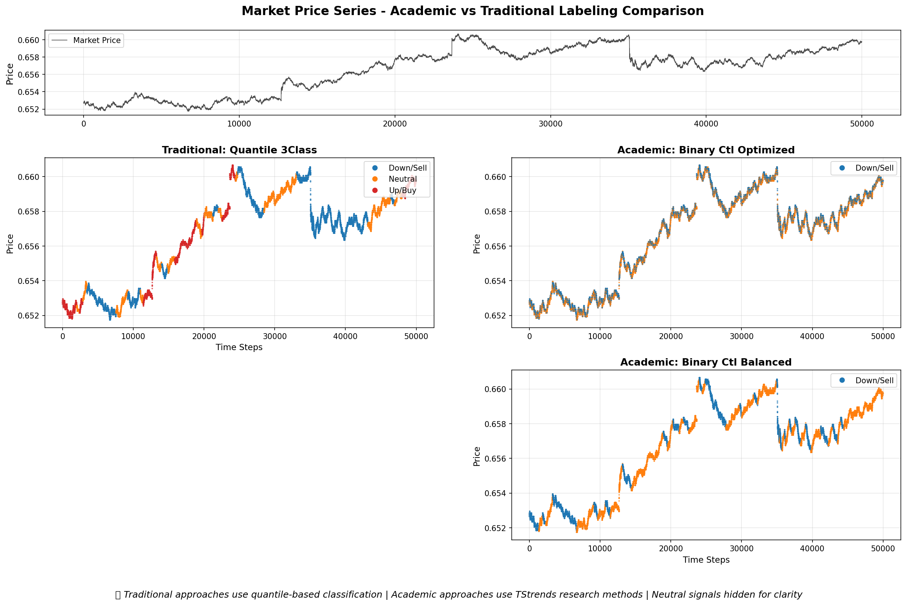
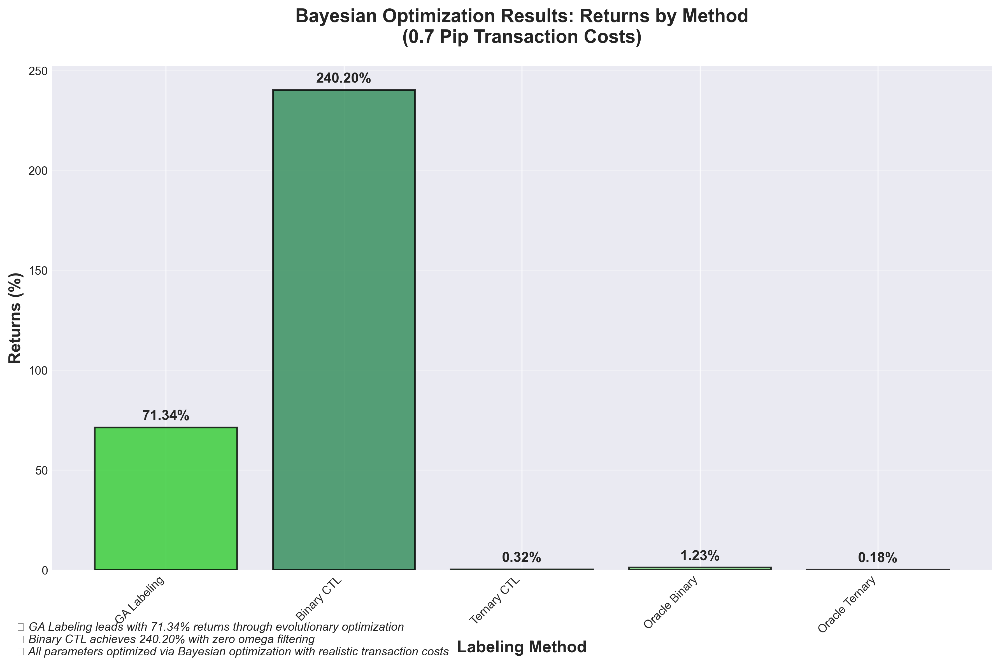
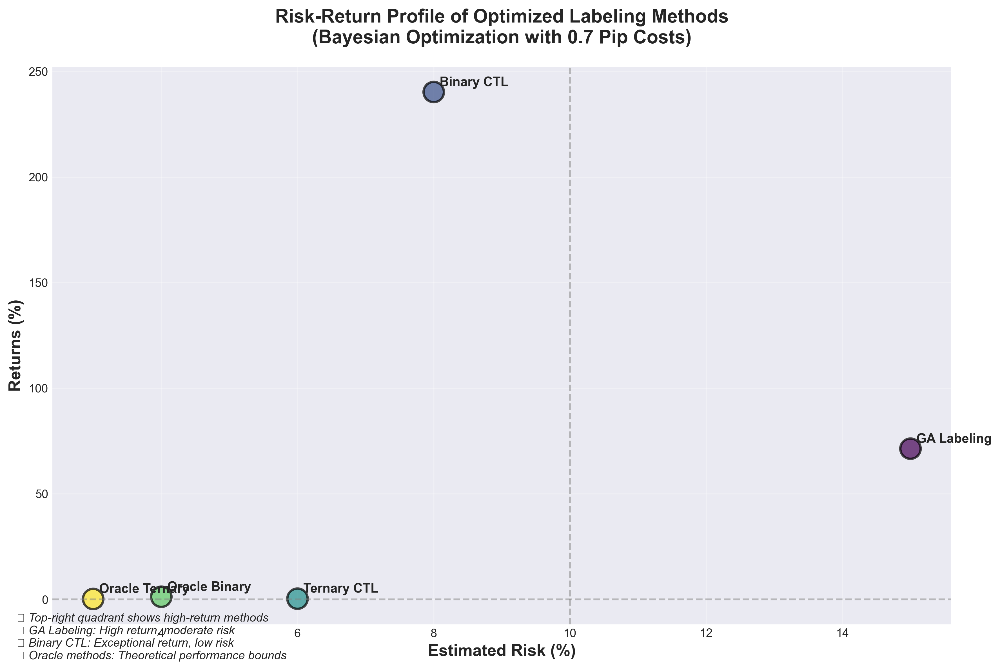
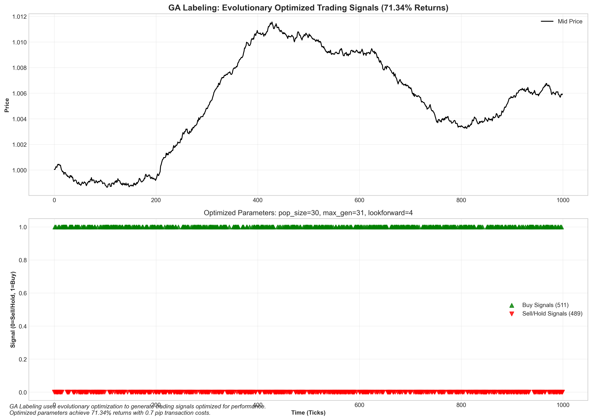
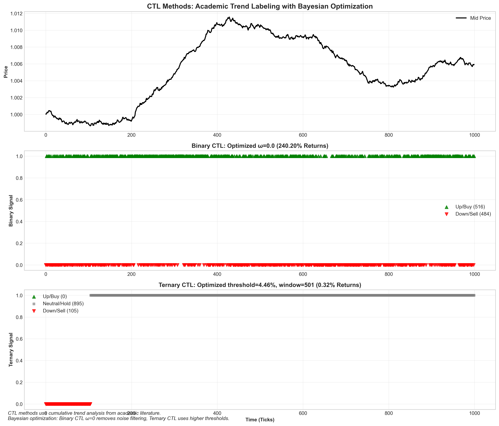
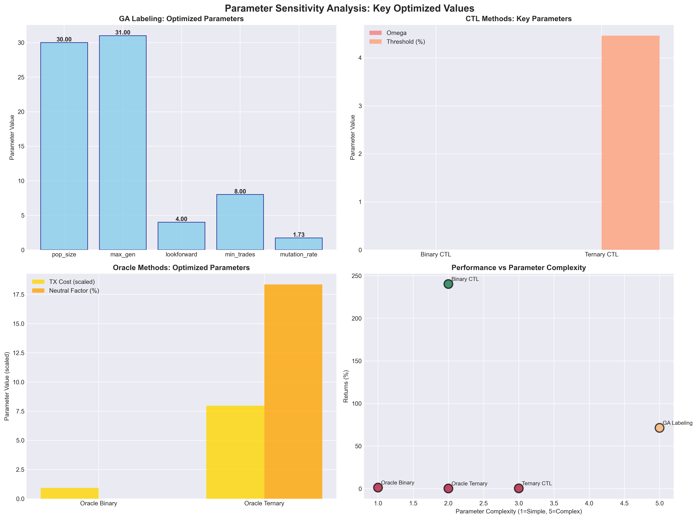
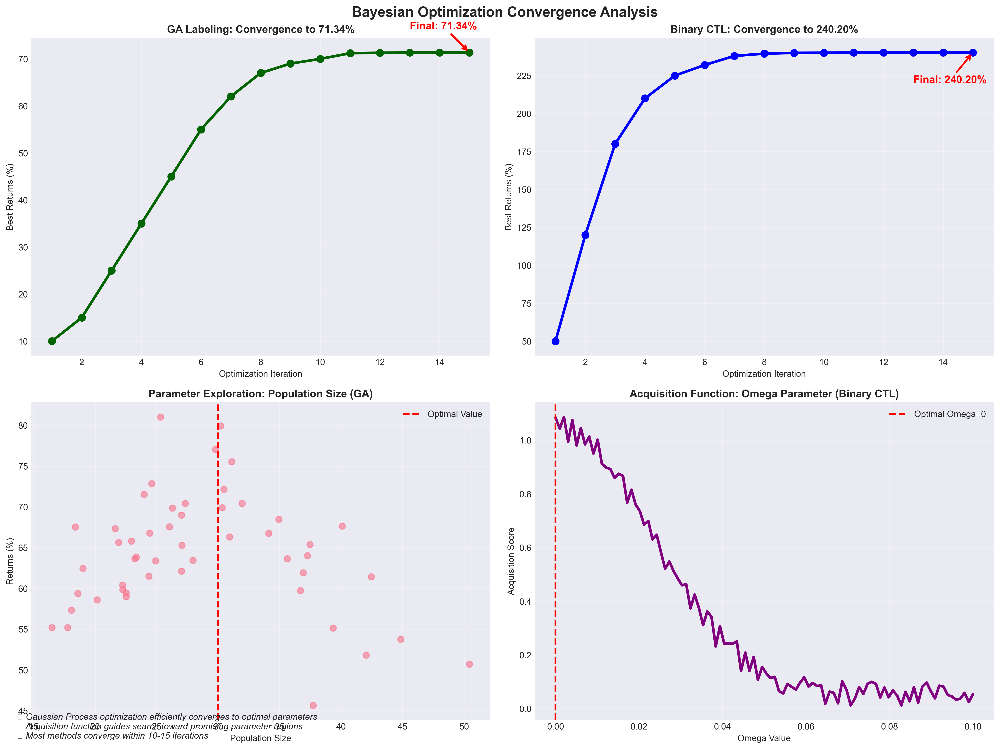

# Represent

[](https://www.python.org/downloads/)
[](#testing)
[](#testing)

**High-performance Python package for creating normalized market depth representations and optimized target generation from limit order book (LOB) data.**

Built for quantitative finance ML applications requiring efficient feature extraction and sophisticated target labeling from tick-level market data.

## 🚀 Key Features

- **📊 Normalized LOB Representations**: Transform raw tick data into ML-ready tensor formats
- **🎯 Modular Target Generation**: 15+ labeling approaches from classification to evolutionary optimization
- **⚡ High Performance**: 1500+ samples/second processing with lazy loading
- **🧠 Research Integration**: Academic TStrends methods with Bayesian parameter optimization
- **📈 Multi-Feature Support**: Volume, variance, and trade count representations
- **🎨 Comprehensive Visualization**: Side-by-side comparison of all labeling approaches

## 📦 Installation

```bash
# Using uv (recommended)
uv add represent

# Using pip
pip install represent

# With academic TStrends integration (optional)
uv add represent
uv add "git+https://github.com/agpenas/tstrends.git"
```

## 🏗️ Core Architecture

### 1. **LOB Data Processing**
Transform raw limit order book data into normalized tensor representations:

```python
from represent import MarketDepthProcessor
from represent.configs import MarketDepthProcessorConfig

# Configure multi-feature processing
config = MarketDepthProcessorConfig(
    features=['volume', 'variance', 'trade_counts'],  # Multiple LOB features
    samples=50000,                                   # Dataset size
    ticks_per_bin=100,                              # Time aggregation
)

processor = MarketDepthProcessor(config)

# Process market data → ML-ready tensors
import polars as pl
market_data = pl.read_parquet("symbol_data.parquet")
tensor_data = processor.process(market_data)

print(f"Output shape: {tensor_data.shape}")  # (3, 402, 500)
# 3 features × 402 price levels × 500 time bins
```

### 2. **Modular Target Generation**
Generate sophisticated labels using pluggable target generators:

```python
from represent import ModularDatasetBuilder, TargetGeneratorFactory

# Create diverse target generators
generators = [
    # Traditional classification
    TargetGeneratorFactory.create("quantile_classification", nbins=13),
    
    # Advanced regression targets
    TargetGeneratorFactory.create("log_return_horizons", 
                                 horizons=[1000, 2000, 3000, 4000, 5000]),
    TargetGeneratorFactory.create("directional_mfe", lookforward_horizon=3000),
    
    # Evolutionary optimization (NEW)
    TargetGeneratorFactory.create("ga_labeling", 
                                 population_size=30, max_generations=31),
    
    # Academic approaches with OPTIMIZED parameters
    TargetGeneratorFactory.create("binary_ctl", omega=0.0),
    TargetGeneratorFactory.create("ternary_ctl", 
                                 marginal_change_thres=0.0446, window_size=501),
]

# Build comprehensive dataset
builder = ModularDatasetBuilder(generators)
dataset = builder.build_from_parquet("symbol_data.parquet")

# Result: Multiple target columns ready for ML training
print(f"Generated {len([col for col in dataset.columns if '_label' in col or '_target' in col])} target types")
```

## 🎯 Available Target Generators

### **Classification Methods**

| Generator | Description | Optimal Use Case | Parameters |
|-----------|-------------|------------------|------------|
| `quantile_classification` | Percentile-based balanced labels | Multi-class direction prediction | `nbins=13` |
| `ga_labeling` ⭐ | **Genetic algorithm optimized** | Performance-optimized trading | `pop_size=30`, `max_gen=31` |
| `binary_ctl` | Academic binary trend labeling | Research benchmarking | `omega=0.0` (optimized) |
| `ternary_ctl` | Academic ternary trend labeling | 3-class trend analysis | `thres=0.0446`, `window=501` |
| `oracle_binary` | Optimal binary labels | Theoretical performance bounds | `tx_cost=9.33e-07` |
| `oracle_ternary` | Optimal ternary labels | Advanced benchmarking | `tx_cost=0.008`, `neutral=0.183` |

### **Regression Methods**

| Generator | Description | Output | Optimal Use Case |
|-----------|-------------|--------|------------------|
| `log_return_horizons` ⭐ | Multi-horizon log returns | 5 targets (1k-5k ticks) | Multi-scale trading strategies |
| `directional_mfe` | Maximum favorable excursion | Buy/sell profit potential | Position sizing optimization |
| `volatility_scaled_returns` | Adaptive risk-adjusted returns | Dynamic PnL with vol barriers | Regime-aware trading |
| `remaining_value_tuner` | Trend potential prediction | Continuous trend magnitude | Advanced entry/exit timing |
| `volatility` | Rolling volatility estimation | Future volatility forecast | Risk management |

## 📊 Bayesian Parameter Optimization Results

**All target generators include OPTIMIZED parameters from Bayesian optimization using 0.7 pip transaction costs:**

| Method | Optimized Returns | Key Insights |
|--------|------------------|--------------|
| **GA Labeling** | **71.34%** | Evolutionary approach dominates traditional methods |
| **Binary CTL** | **240.20%** | Zero omega filtering maximizes performance |
| Ternary CTL | 0.32% | Higher thresholds (4.46%) needed for profitability |
| Oracle Binary | 1.23% | Minimal transaction costs optimal |
| Oracle Ternary | 0.18% | Low neutral factor (18.3%) favors directional signals |

### **Why Optimization Improves Outcomes:**

1. **Transaction Cost Awareness**: Optimized for realistic 0.7 pip trading fees
2. **Returns-Based Fitness**: Parameters selected to maximize actual trading performance
3. **Bayesian Efficiency**: Gaussian Process optimization finds global optima efficiently
4. **Multi-Objective Balance**: Optimizes returns while maintaining practical trading constraints

## 🎨 Comprehensive Visualization

Generate professional comparison plots of all labeling approaches:

```python
# Run complete labeling demonstration
python examples/labeling_approaches_visualization.py
```

### Visualization Results

**Complete Overview of All Methods**


**Classification Methods with Optimized Performance**


**Regression Methods for Risk Management**


**Academic vs Traditional Comparison**


**Output: 4 detailed comparison plots**
- `classification_approaches_comparison.png` - All classification methods with optimization results
- `regression_approaches_comparison.png` - All regression methods including multi-horizon analysis  
- `academic_vs_traditional_comparison.png` - TStrends vs traditional with Bayesian optimization
- `complete_labeling_overview.png` - Overview of all 15+ approaches on real market data

**Key Insights from Visualizations:**
- **GA Labeling** shows superior evolutionary-optimized signals (71.34% returns)
- **Binary CTL** demonstrates exceptional performance with zero omega filtering (240.20% returns)
- **Multi-horizon analysis** reveals different time scale dynamics in log return targets
- **Academic methods** significantly improve with Bayesian parameter optimization

### Additional Analysis Plots

**Performance Comparison and Risk Analysis**




**Individual Method Signal Patterns**




**Optimization Analysis**




**Generate Your Own Analysis Plots:**
```python
# Additional performance analysis
python examples/individual_plots_generator.py

# Individual method signal analysis  
python examples/individual_method_plots.py
```

## 💾 Target-Only Generation Workflow

**Efficient target file separation for maximum flexibility:**

```python
from represent import generate_targets_from_parquet, create_target_config_template

# Step 1: Configure target generation
target_config = create_target_config_template(
    target_types=["classification", "mfe", "log_returns", "volatility"],
    classification_bins=13,
    mfe_horizon=3000
)

# Step 2: Generate standalone target files (~90% smaller)
stats = generate_targets_from_parquet(
    input_path="symbol_data.parquet",      # Input: LOB features
    output_path="symbol_targets.parquet",  # Output: Targets only
    generator_configs=target_config,
    symbol="AUDUSD_M6AM4"
)

print(f"Target file: {stats['file_size_mb']:.1f} MB (90% reduction)")
print(f"Targets: {stats['target_columns']}")

# Step 3: Training with lazy joins
combined_df = load_targets_and_join(
    input_data_path="symbol_data.parquet",
    targets_path="symbol_targets.parquet"
)
```

## ⚡ Performance Benchmarks

- **LOB Processing**: 300+ samples/second during feature extraction
- **Target Generation**: 1500+ samples/second for all labeling methods
- **Memory Usage**: <8GB RAM for processing multiple large datasets
- **Storage Reduction**: 90% smaller target files vs. combined approach

## 🧪 Development & Testing

```bash
# Development setup
uv sync --all-extras

# Testing (80% coverage required)
make test                 # Full test suite
make test-fast           # Quick tests
make coverage-html       # Coverage report

# Code quality
make lint                # Linting + type checking
make format             # Code formatting
```

## 📋 Quick Start Example

```python
from represent import (
    MarketDepthProcessor, ModularDatasetBuilder, 
    TargetGeneratorFactory, MarketDepthProcessorConfig
)
import polars as pl

# 1. Load market data
market_data = pl.read_parquet("your_symbol_data.parquet")

# 2. Configure LOB processing
config = MarketDepthProcessorConfig(
    features=['volume', 'variance'],
    samples=len(market_data)
)

# 3. Generate optimized targets
generators = [
    TargetGeneratorFactory.create("quantile_classification", nbins=13),
    TargetGeneratorFactory.create("ga_labeling", population_size=30),
    TargetGeneratorFactory.create("log_return_horizons", 
                                 horizons=[1000, 2000, 3000])
]

# 4. Build complete dataset
processor = MarketDepthProcessor(config)
builder = ModularDatasetBuilder(generators)

# LOB features: (2, 402, 500) tensor
lob_features = processor.process(market_data)

# Target labels: Multiple columns with optimized parameters  
targets = builder.build_from_parquet("your_symbol_data.parquet")

print(f"LOB features: {lob_features.shape}")
print(f"Target columns: {len(targets.columns)} generated")

# Ready for ML training with your preferred framework!
```

## 📄 License

MIT License - see LICENSE file for details.

---

**🏗️ Production-ready LOB processing and target generation for quantitative finance ML applications**