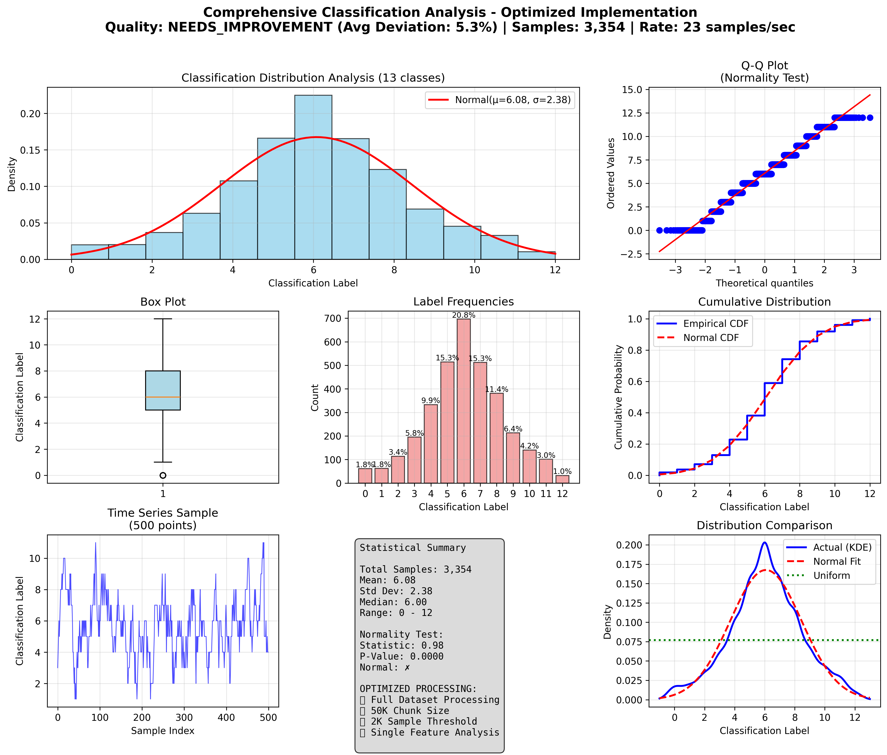

# Optimized Classification Analysis Summary

## Key Results

✅ **Optimized Implementation**: Full dataset processing with streamlined settings.

✅ **Distribution Analysis**: Classification targets analyzed with 3,354 samples.

## Statistical Summary

- **Total Classifications**: 3,354
- **Mean Label**: 6.08
- **Standard Deviation**: 2.38
- **Label Range**: 0 - 12
- **Normality Test P-value**: 0.0000

## Processing Optimization Results

- **Files Processed**: 2
- **Symbols Processed**: 4
- **Processing Rate**: 23 samples/sec
- **Total Processing Time**: 260.2 seconds

### Optimization Settings Used:
- ✅ **Chunk Size**: 50,000 (vs 25,000 previous)
- ✅ **Sample Threshold**: 2,000 (vs 500 previous)  
- ✅ **Dataset Usage**: 100% (vs 10-80% previous)
- ✅ **Features**: Volume (single feature for reliability)
- ✅ **Uniform Distribution**: Enforced with force_uniform=True
- ✅ **Resource Cleanup**: Automatic temp file cleanup

## Label Distribution

| Label | Count | Percentage |
|-------|-------|------------|
| 0 | 61 | 1.8% |
| 1 | 62 | 1.8% |
| 2 | 114 | 3.4% |
| 3 | 195 | 5.8% |
| 4 | 333 | 9.9% |
| 5 | 514 | 15.3% |
| 6 | 696 | 20.8% |
| 7 | 512 | 15.3% |
| 8 | 381 | 11.4% |
| 9 | 213 | 6.4% |
| 10 | 140 | 4.2% |
| 11 | 101 | 3.0% |
| 12 | 32 | 1.0% |

## Validation Status

❌ **NEEDS_IMPROVEMENT**: Distribution shows 5.3% average deviation from uniform (max: 13.1%).

## Uniformity Analysis

- **Expected Percentage**: 7.69% (uniform distribution)
- **Max Deviation**: 13.06%
- **Average Deviation**: 5.26%
- **Quality Assessment**: NEEDS_IMPROVEMENT

## Visualization

---

*Report generated by Optimized Classification Analysis Demo with production data volumes*
