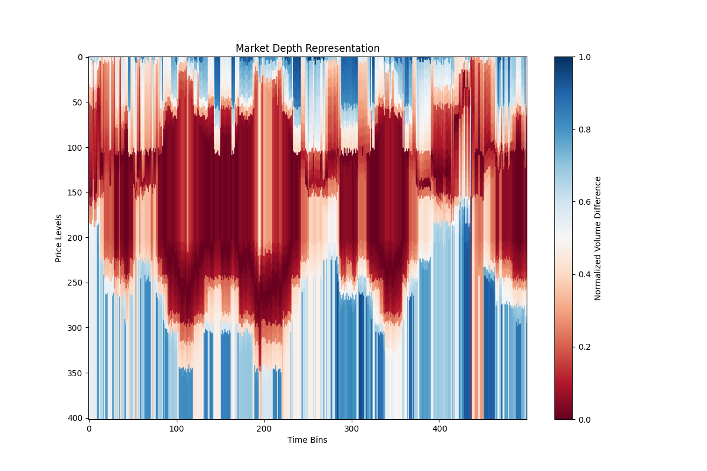

# Market Depth Visualization Example

This example demonstrates how to use the `represent` library to process real market data and generate a visualization of the resulting market depth representation.

## Workflow

The process is as follows:

1.  **Load Data**: Real market data is loaded from a `.dbn.zst` file using the `databento` library.
2.  **Process Data**: The data is processed using the `represent.process_market_data` function, which returns a `numpy` array of the normalized absolute combined market depth.
3.  **Generate Visualization**: A heatmap of the resulting array is generated using `matplotlib`, providing a visual representation of market depth dynamics over time.

## Code

The following Python script is used to generate the visualization:

```python
"""
Generates a visualization of the market depth representation.

This script loads real market data, processes it using the 'represent' library,
and creates a heatmap of the resulting normalized market depth array.
The output is saved as a PNG image that can be easily viewed.
"""
import databento as db
import matplotlib.pyplot as plt
import numpy as np
import polars as pl
from represent.pipeline import process_market_data

def generate_visualization():
    """
    Loads data, processes it, and generates a heatmap visualization.
    """
    # Load the real market data from the .dbn.zst file
    data = db.DBNStore.from_file("data/glbx-mdp3-20240405.mbp-10.dbn.zst")
    df_pandas = data.to_df()

    # Filter by symbol using pandas, as in the notebook
    df_pandas = df_pandas[df_pandas.symbol == "M6AM4"]
    
    # Define slicing parameters based on the notebook's logic
    SAMPLES = 50000
    OFFSET = 120000
    start = OFFSET
    stop = OFFSET + SAMPLES
    
    if len(df_pandas) < stop:
        raise ValueError(f"Not enough data to generate a visualization. Need {stop} samples, but only have {len(df_pandas)}.")

    # Take the slice with pandas, then convert to polars
    df_slice_pandas = df_pandas[start:stop]
    df_polars = pl.from_pandas(df_slice_pandas)

    # Process the data to get the normalized market depth representation
    normed_abs_combined = process_market_data(df_polars)

    # Create a heatmap of the processed data
    plt.figure(figsize=(12, 8))
    plt.imshow(normed_abs_combined, cmap='viridis', aspect='auto')
    plt.colorbar(label='Normalized Volume Difference')
    plt.title('Market Depth Representation')
    plt.xlabel('Time Bins')
    plt.ylabel('Price Levels')
    
    # Save the visualization to a file
    plt.savefig('examples/market_depth_visualization.png')
    print("Successfully generated 'examples/market_depth_visualization.png'")

if __name__ == '__main__':
    generate_visualization()
```

## Output

Running the script will produce the following visualization of the market depth representation:


