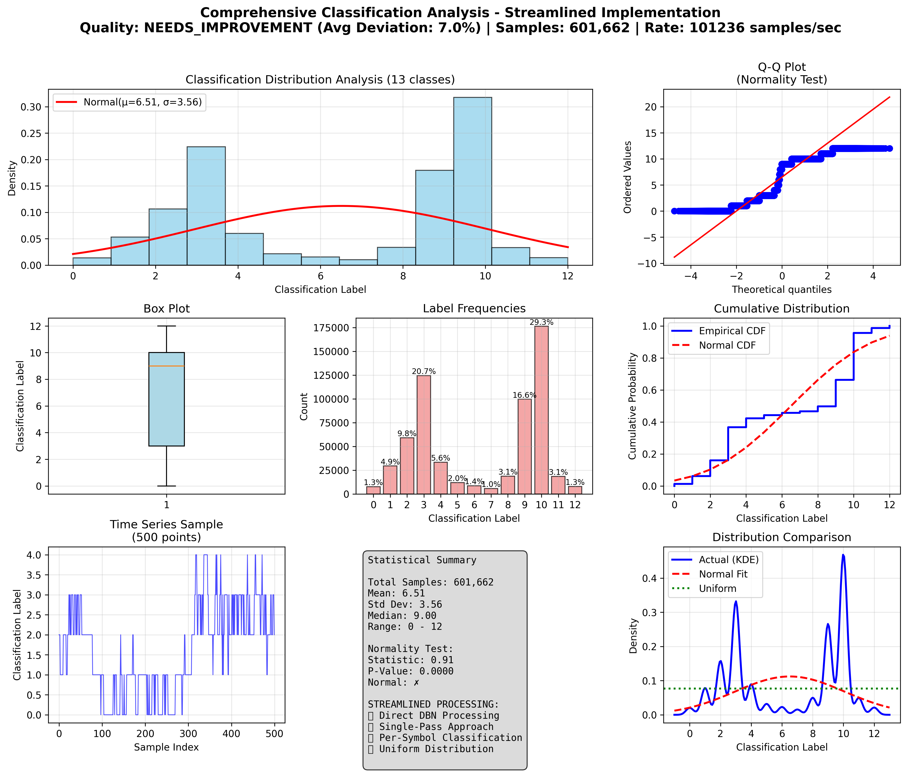

# Streamlined Classification Analysis Summary

## Key Results

✅ **Streamlined Implementation**: Direct DBN-to-classified-parquet processing.

✅ **Distribution Analysis**: Classification targets analyzed with 601,662 samples.

## Statistical Summary

- **Total Classifications**: 601,662
- **Mean Label**: 6.51
- **Standard Deviation**: 3.56
- **Label Range**: 0 - 12
- **Normality Test P-value**: 0.0000

## Streamlined Processing Results

- **Files Processed**: 2
- **Symbols Processed**: 4
- **Processing Rate**: 101236 samples/sec
- **Total Processing Time**: 5.9 seconds

### Streamlined Settings Used:
- ✅ **Processing**: Direct DBN → Classified Parquet
- ✅ **Per-Symbol**: Individual symbol processing  
- ✅ **Uniform Distribution**: Quantile-based classification
- ✅ **Features**: Volume (single feature for reliability)
- ✅ **Quality Threshold**: Min symbol samples enforced
- ✅ **Memory Efficient**: No intermediate files

## Label Distribution

| Label | Count | Percentage |
|-------|-------|------------|
| 0 | 7592 | 1.3% |
| 1 | 29425 | 4.9% |
| 2 | 59172 | 9.8% |
| 3 | 124539 | 20.7% |
| 4 | 33467 | 5.6% |
| 5 | 11962 | 2.0% |
| 6 | 8577 | 1.4% |
| 7 | 5792 | 1.0% |
| 8 | 18673 | 3.1% |
| 9 | 99637 | 16.6% |
| 10 | 176361 | 29.3% |
| 11 | 18506 | 3.1% |
| 12 | 7959 | 1.3% |

## Validation Status

❌ **NEEDS_IMPROVEMENT**: Distribution shows 7.0% average deviation from uniform (max: 21.6%).

## Uniformity Analysis

- **Expected Percentage**: 7.69% (uniform distribution)
- **Max Deviation**: 21.62%
- **Average Deviation**: 7.02%
- **Quality Assessment**: NEEDS_IMPROVEMENT

## Visualization

---

*Report generated by Streamlined Classification Analysis Demo with direct DBN processing*
