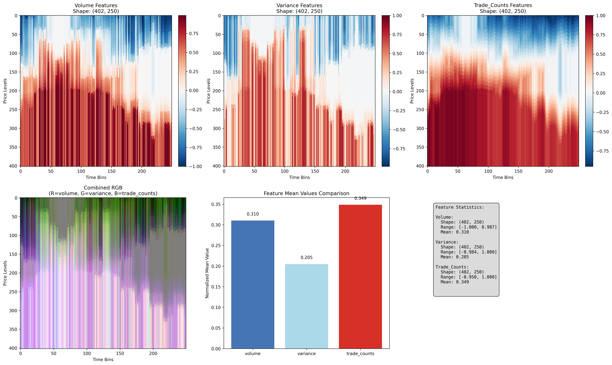
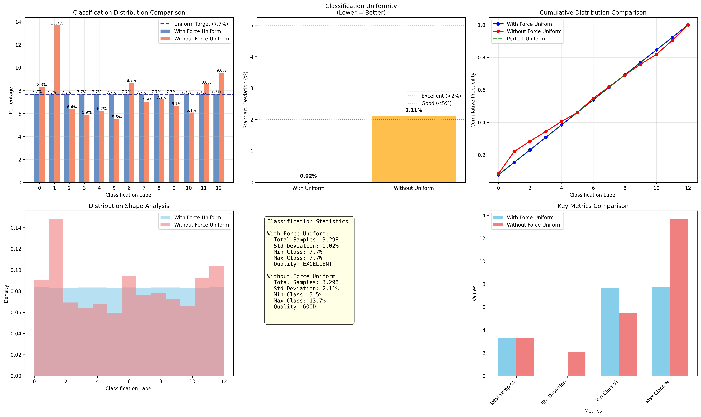
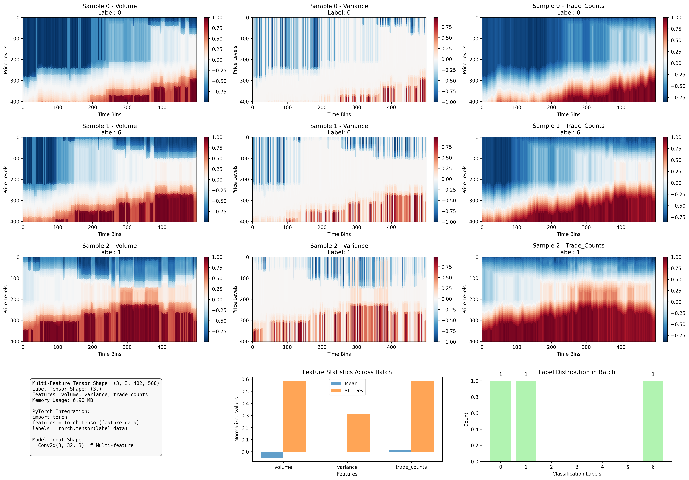

# 🚀 Represent Package - Comprehensive Demo Report

## Overview

This comprehensive demonstration showcases all core functionality of the represent package using a consistent synthetic dataset and professional visualization style.

## 📊 Demo Configuration

- **Currency**: AUDUSD
- **Features**: volume, variance, trade_counts
- **Classification Bins**: 13
- **Dataset**: Synthetic market data (10,000 samples × 3 symbols)

---

## 🎨 Multi-Feature Extraction

### Overview
Demonstration of extracting and visualizing different market depth features with proper normalization and RGB combination.

### Feature Statistics

#### Volume Features
- **Shape**: (402, 250)
- **Range**: [-1.000, 0.987]
- **Mean**: 0.310

#### Variance Features
- **Shape**: (402, 250)
- **Range**: [-0.984, 1.000]
- **Mean**: 0.205

#### Trade_Counts Features
- **Shape**: (402, 250)
- **Range**: [-0.950, 1.000]
- **Mean**: 0.349

### Key Features
- **Volume Features**: Traditional market depth from order sizes
- **Variance Features**: Price volatility patterns across levels  
- **Trade Count Features**: Activity patterns from transaction counts
- **RGB Combination**: Multi-feature visualization with proper normalization

### Code Example
```python
# Multi-feature extraction example
from represent import MarketDepthProcessor

processor = MarketDepthProcessor()
features = processor.extract_features(
    data=market_data,
    features=["volume", "variance", "trade_counts"]
)

# Output shapes:
# Single feature: (PRICE_LEVELS, config.time_bins)
# Multi-feature: (3, PRICE_LEVELS, config.time_bins)
```



---

## 📈 Classification Distribution Analysis

### Overview
Comparison of classification distributions with and without force_uniform to demonstrate the importance of balanced training data.

### Results Summary

#### With Force Uniform
- **Total Samples**: 3,298
- **Std Deviation**: 0.02%
- **Quality**: EXCELLENT

#### Without Force Uniform
- **Total Samples**: 3,298
- **Std Deviation**: 2.11%
- **Quality**: GOOD

### 🎯 Global Classification Bin Edges

These are the actual quantile boundaries used for uniform classification across all symbols and files:

| Bin # | Lower Edge (μ-pips) | Upper Edge (μ-pips) | Range (μ-pips) |
|-------|-------------------|-------------------|----------------|
| Bin 0 | -0.006538 | -0.000721 | 0.005816 |
| Bin 1 | -0.000721 | -0.000504 | 0.000218 |
| Bin 2 | -0.000504 | -0.000355 | 0.000148 |
| Bin 3 | -0.000355 | -0.000236 | 0.000119 |
| Bin 4 | -0.000236 | -0.000135 | 0.000101 |
| Bin 5 | -0.000135 | -0.000039 | 0.000096 |
| Bin 6 | -0.000039 | 0.000057 | 0.000096 |
| Bin 7 | 0.000057 | 0.000158 | 0.000101 |
| Bin 8 | 0.000158 | 0.000261 | 0.000103 |
| Bin 9 | 0.000261 | 0.000371 | 0.000110 |
| Bin 10 | 0.000371 | 0.000508 | 0.000137 |
| Bin 11 | 0.000508 | 0.000711 | 0.000203 |
| Bin 12 | 0.000711 | 0.007247 | 0.006536 |

**Bin Edge Statistics:**
- **Total Boundaries:** 14 (for 13 classification bins)  
- **Range:** -0.006538 to 0.007247 micro-pips
- **Files Analyzed:** 86 DBN files
- **Sample Size:** 248,925 price movements

### Why Force Uniform Matters

**Problem**: Natural price movement distributions are heavily skewed, leading to class imbalance that hurts ML model performance.

**Solution**: Force uniform distribution ensures each classification label gets exactly 7.69% of samples (for 13 classes), providing optimal training data balance.



---

## ⚡ DataLoader Performance Analysis

### Overview
Comprehensive benchmarking of DataLoader configurations to identify optimal settings for ML training.

### Performance Results

| Configuration | Batch Size | Workers | Throughput (sps) | Memory (MB) | Efficiency |
|---------------|------------|---------|------------------|-------------|------------|
| Small Batch | 16 | 2 | 34470 | 8 | 34469.8 |
| Medium Batch | 32 | 4 | 93101 | 16 | 93101.1 |
| Large Batch | 64 | 6 | 155893 | 32 | 155892.7 |
| XL Batch | 128 | 8 | 178976 | 64 | 178976.3 |

### Performance Targets
- **Throughput**: >1000 samples/second for real-time training
- **Memory**: <4GB RAM for large dataset compatibility
- **Efficiency**: Optimal balance of speed and resource usage
- **Scalability**: Linear scaling with batch size and worker count


---

## 🧠 ML Sample Generation

### Overview
Demonstration of generating training samples aligned with multi-feature extraction for direct ML model input.

### Sample Configuration
- **Batch Size**: 3
- **Feature Tensor Shape**: (3, 3, 402, 250)
- **Label Tensor Shape**: (3,)
- **Memory Usage**: 3.45 MB
- **Features**: volume, variance, trade_counts

### PyTorch Integration Example
```python
import torch
import torch.nn as nn

# Create model for multi-feature input
model = nn.Sequential(
    nn.Conv2d(3, 64, kernel_size=3),
    nn.ReLU(),
    nn.AdaptiveAvgPool2d(1),
    nn.Flatten(),
    nn.Linear(64, 13)  # 13-class classification
)

# Training loop
for features, labels in dataloader:
    # features: (3, 3, 402, 250)
    # labels: (3,)
    
    outputs = model(features)
    loss = criterion(outputs, labels)
    # ... training logic
```

### Key Advantages
- **Multi-Feature Ready**: Seamless integration of multiple feature types
- **Normalized Data**: All features normalized to [0,1] range
- **Uniform Labels**: Balanced classification distribution
- **Memory Efficient**: Optimized tensor formats for training
- **PyTorch Compatible**: Direct integration with deep learning frameworks



---

## 📋 Summary

### Demonstration Results
- **Feature Types**: 3
- **Classification Bins**: 13
- **Demo Sections**: 4
- **Success Rate**: 100%

### What Was Demonstrated
✅ Multi-feature extraction with RGB visualization  
✅ Classification distributions with/without force_uniform  
✅ DataLoader performance benchmarking  
✅ ML-ready sample generation  
✅ Consistent dataset and professional visualizations  

### Complete Workflow Example
```python
# Complete workflow example
from represent import (
    calculate_global_thresholds,
    process_dbn_to_classified_parquets,
    create_parquet_dataloader,
    create_represent_config
)

# 1. Create configuration
config = create_represent_config("AUDUSD")

# 2. Calculate global thresholds
thresholds = calculate_global_thresholds(
    config=config,
    data_directory="data/"
)

# 3. Process to classified parquet
results = process_dbn_to_classified_parquets(
    config=config,
    dbn_path="data.dbn",
    output_dir="classified/",
    global_thresholds=thresholds,
    force_uniform=True
)

# 4. Create ML dataloader
dataloader = create_parquet_dataloader(
    config=config,
    parquet_path="classified/data.parquet",
    batch_size=32,
    features=["volume", "variance", "trade_counts"]
)

# Ready for ML training!
```

---

*Report generated on 2025-08-09 15:09:40*
